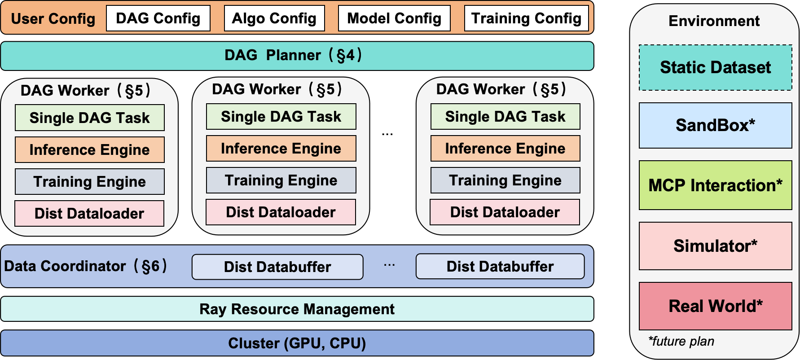
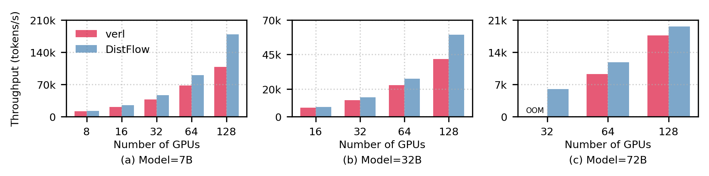
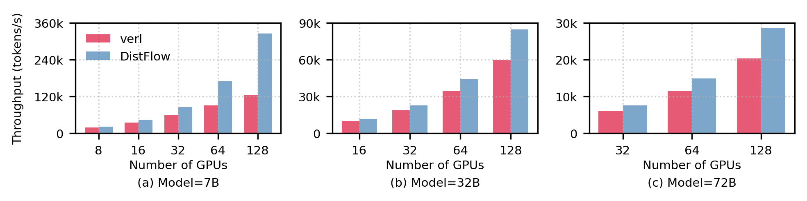
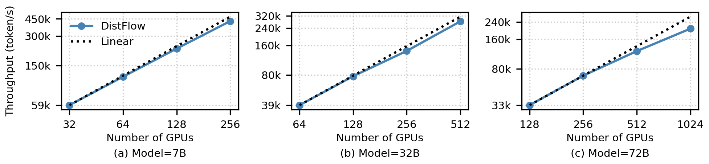
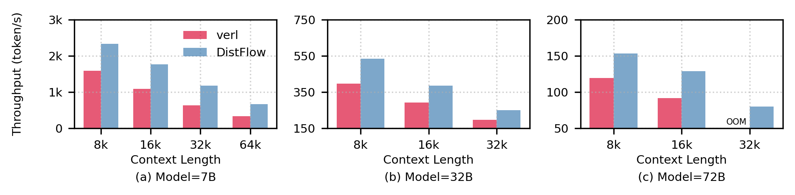
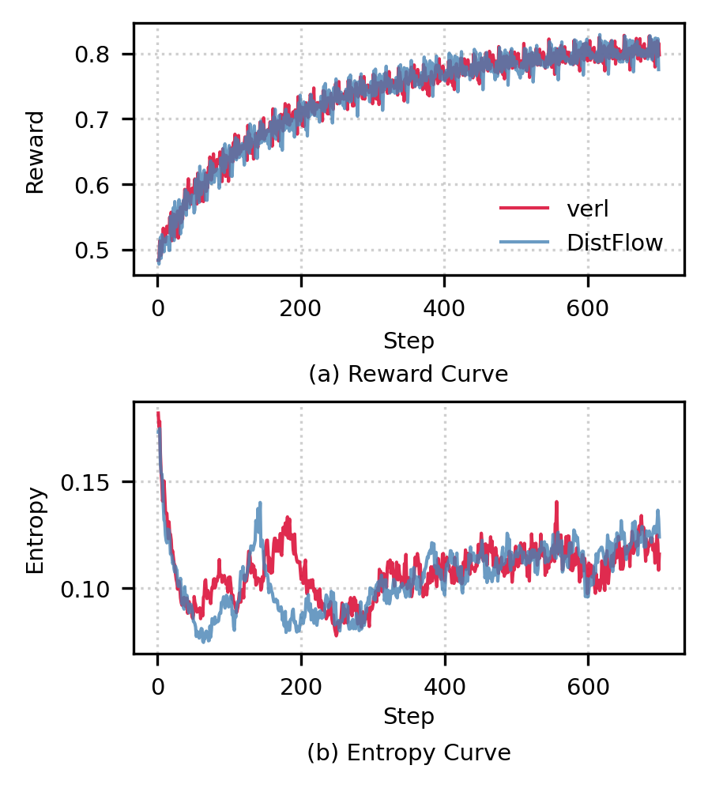

<div align="center">
  
  <br>
</div>
<br>

<h1 align="center">
siiRL: Shanghai Innovation Institute RL Framework for Advanced LLMs and Multi-Agent Systems
</h1>

<p align="center">
| <a href="https://arxiv.org/abs/2507.13833"><b>📄 论文</b></a> | 
| <a href="https://siirl.readthedocs.io/en/latest/index.html"><b>📚 文档</b></a> |
| <a href="asset/siiRL-feishu-group.png">
     
    <b> 飞书群</b>
  </a> 
| <a href="asset/siiRL-wechat-group.png">
     
    <b> 微信群</b>
  </a> 
| <a href="README.md"><b> English</b></a> |
</p>

**siiRL** 是一个新型的、**完全分布式的强化学习 (RL) 框架**，旨在突破大语言模型 (LLM) 后训练中的扩展性瓶颈，并支持未来的多智能体研究，由**上海创智学院**的研究人员开发。

通过移除主流框架中的中心化数据流控制器，siiRL 实现了**近线性的扩展能力**、**显著的吞吐量提升**，通过DAG模块化的设计获得了**极大的的灵活性**，为基于强化学习的 LLM 开发带来了全新的可能性。

---

## 🚀 亮点

+ **近线性扩展能力**: 多控制器模式通过将控制逻辑和数据管理分布到所有工作节点，消除了中心化瓶颈，从而实现了在数千张 GPU 上的近线性扩展。

+ **业界领先的吞吐量 (SOTA)**: 完全分布式的数据流架构最大限度地减少了通信和 I/O 开销，在数据密集型场景中实现了业界领先的吞吐量。

+ **灵活的 DAG 定义流水线**: 将您的算法逻辑与物理硬件解耦。通过 siiRL，您可以将复杂的 RL 工作流定义为一个简单的有向无环图 (DAG)，从而实现快速、经济且无需编写代码的实验。

+ **跨硬件兼容性**: siiRL 现已正式支持华为昇腾 (Ascend) NPU，为在不同硬件平台上进行训练和推理提供了高性能的替代方案。

+ **经过验证的性能与稳定性**: 在 7B 到 72B 尺寸的模型上进行了广泛的基准测试，siiRL 在各种任务中均表现出卓越的性能。其优势在长上下文和多模态训练等数据密集型工作负载中尤为明显。

---

## 📰 最新动态

* **[2025/11]**: siiRL 现已支持视觉-语言-动作（VLA）模型训练，基于 [SRPO (Self-Referential Policy Optimization for Vision-Language-Action Models)](https://arxiv.org/pdf/2511.15605) 算法，实现了机器人任务的具身强化学习训练。详细使用方法请参考[文档](/docs/examples/embodied_srpo_example.rst)。

* **[2025/09]**: siiRL 现已集成 Megatron 训练后端，并支持MoE模型训练。其性能已在 Qwen3-MoE 模型（30B、235B）上得到验证。

* **[2025/09]**: siiRL通过与华为昇腾、沐曦科技、阿里云等主要厂商合作，现已支持在其GPU 集群上从 32 卡稳定扩展至 1024 卡，线性扩展效率超过 90%。

* **[2025/09]**: siiRL 支持多智能体与环境之间进行多轮交互。

* **[2025/07]**: siiRL 为 LaMAS 新增了 [MARFT](https://arxiv.org/pdf/2504.16129) 支持，可通过 Flex-POMDP 对 LLM 多智能体进行强化学习微调。

* **[2025/07]**: siiRL 现已支持 [CPGD](https://arxiv.org/pdf/2505.12504v1)，这是一种通过正则化大幅度的策略更新来增强 RL 训练稳定性和性能的算法。

* **[2025/07]**: 我们很开心向开源社区发布 siiRL！欢迎查阅我们的[论文](https://arxiv.org/abs/2507.13833)，深入了解其架构和评测。

---

## 💡 架构概览

siiRL 是一个为大规模集群设计的完全分布式强化学习框架。siiRL 采用多控制器模式，将所有计算和数据流均匀地分派到每个 GPU。siiRL 由三个主要组件构成：DAG Planner，DAG Workers 和 Data Coordinator.

<div align="center">
  
  <p><i>图 1. siiRL 架构概览。</i></p>
</div>

siiRL 是一个**完全分布式、多控制器的架构**。

关键组件包括：
* **DAG Planner**: 将用户定义的 DAG 转换为序列化、可供每个DAG Worker执行的流水线。
* **DAG Workers**: 核心执行单元，每个DAG Worker绑定到单个 GPU，独立运行其分配的任务。
* **Data Coordinator**: 一组分布式组件（`分布式数据加载器`和`分布式数据缓冲区`），无需中央协调器即可管理从初始加载到中间数据重分配的整个数据生命周期。

### 典型支持的模型与算法

<table style="width: 100%; table-layout: auto; border-collapse: collapse;">
  <thead align="center" valign="bottom">
    <tr>
      <th style="min-width: 120px;">模型</th>
      <th style="min-width: 120px;">算法</th>
    </tr>
  </thead>
  <tbody valign="top">
    <tr>
      <td>
        <b>Qwen2.5 系列</b>
        <ul style="margin-left: 0; padding-left: 16px;">
          <li>Qwen2.5-7B </li>
          <li>Qwen2.5-72B </li>
          <li>Qwen2.5-VL-7B </li>
          <li>Qwen2.5-VL-72B </li>
        </ul>
        <b>Qwen3 系列</b>
        <ul style="margin-left: 0; padding-left: 16px;">
          <li>Qwen3-1.7B </li>
          <li>Qwen3-30B </li>
          <li>Qwen3-235B-A22B (MoE) </li>
        </ul>
        <b>VLA 模型</b>
        <ul style="margin-left: 0; padding-left: 16px;">
          <li>OpenVLA </li>
          <li>OpenVLA-OFT </li>
          <li>Custom MLP-Policy </li>
        </ul>
      </td>
      <td>
        <b>强化学习算法</b>
        <ul style="margin-left: 极: 0; padding-left: 16px;">
          <li>GRPO </li>
          <li>PPO </li>
          <li>DAPO </li>
          <li>GSPO </li>
        </ul>
      </td>
    </tr>
  </tbody>
</table>

## 🧪 实验评测

我们对 siiRL 的性能和扩展性进行了全面评测，并与业界领先的 RL 框架 verl 进行了比较。实验表明，siiRL 在所有指标上均表现出卓越的性能。

### 端到端吞吐量
在标准的 PPO 和 GRPO 算法下，siiRL 的吞吐量全面超越了基线系统。特别是在数据密集度更高的 GRPO 算法下，siiRL 通过其完全分布式的架构有效解决了数据瓶颈，实现了高达 **2.62 倍**的性能提升。

<p align="center">

<br>
<em>图 2:  PPO 算法下端到端性能对比</em>
</p>
<p align="center">

<br>
<em>图 3: GRPO 算法下端到端性能对比</em>
</p>

### 大规模扩展性
siiRL 展示了近线性的扩展能力，可平滑扩展至 1024 张 GPU。相比之下，基线框架由于其单点数据瓶颈导致的 OOM (内存不足) 错误，在相同条件下运行失败。在基线系统所能支持的最大批量大小下，siiRL 的性能优势可高达 **7 倍**。

<p align="center">

<br>
<em>图 4: siiRL 的扩展性测试</em>
</p>

<p align="center">

<br>
<em>图 5: 在基线系统最大负载下的性能对比</em>
</p>

### 长上下文性能
在处理长上下文任务时，数据传输开销成为主要瓶颈。siiRL 的分布式数据流设计使其性能优势随着上下文长度的增加而愈发明显，实现了高达 **2.03 倍**的吞吐量提升，并成功运行了基线系统无法处理的 72B 模型长上下文任务。

<p align="center">

<br>
<em>图 6: 长上下文场景下的性能对比</em>
</p>

### 模型收敛性
实验证实，siiRL 的性能优化并未以牺牲模型精度为代价。在超参数相同的情况下，siiRL 的奖励和熵收敛曲线与基线系统完全一致，同时将总训练时间**减少了 21%**。

<p align="center">

<br>
<em>图 7: 模型收敛曲线对比</em>
</p>

---

## 📚 相关资源

<a href="https://siirl.readthedocs.io/en/latest/index.html"><b>使用文档</b></a>

- <a href="https://siirl.readthedocs.io/en/latest/start/install.html"><b>安装指南</b></a>

- <a href="https://siirl.readthedocs.io/en/latest/start/quickstart.html"><b>快速入门: 运行 PPO/GRPO</b></a>

---

## 🗓️ 未来计划

siiRL 仍在积极开发中。我们对未来充满期待，并致力于在两个关键方向上扩展框架的功能：支持真实机器人 VLA 训练和训练推理分离。

### 具身 VLA 训练与真实世界部署
我们正在扩展视觉-语言-动作（VLA）能力，以支持**真实世界机器人部署**。

### 训练-推理分离架构
为增强部署灵活性和资源利用率，我们正在开发**解耦的训练-推理架构**。

---

## 🙏 致谢

我们首先要感谢开源 RL 框架 [verl](https://github.com/volcengine/verl)，我们使用它作为评测的主要基线系统。我们特别感谢其分层的 API 设计；我们复用了 verl 中的 `3DParallelWorker` 基类来管理 siiRL 中的系统组件。

siiRL 的构建也离不开其他优秀的开源项目。我们衷心感谢 PyTorch、Ray、vLLM、vLLM-Ascend 和 SGLang 团队的杰出工作。

我们的工作解决了研究过程中发现的扩展性问题并设计了灵活的工作流设计，并希望 siiRL 能为社区的共同进步做出积极贡献。

---

## 🖋️ 如何引用

如果您在研究中发现 siiRL 对您有帮助，请考虑引用我们的论文。

```bibtex
@misc{wang2025distflowfullydistributedrl,
      title={DistFlow: A Fully Distributed RL Framework for Scalable and Efficient LLM Post-Training}, 
      author={Zhixin Wang and Tianyi Zhou and Liming Liu and Ao Li and Jiarui Hu and Dian Yang and Jinlong Hou and Siyuan Feng and Yuan Cheng and Yuan Qi},
      year={2025},
      eprint={2507.13833},
      archivePrefix={arXiv},
      primaryClass={cs.DC},
      url={[https://arxiv.org/abs/2507.13833](https://arxiv.org/abs/2507.13833)}, 
}