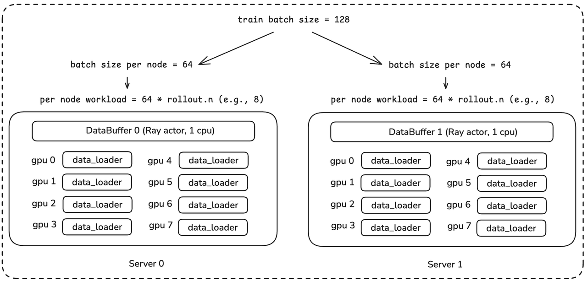
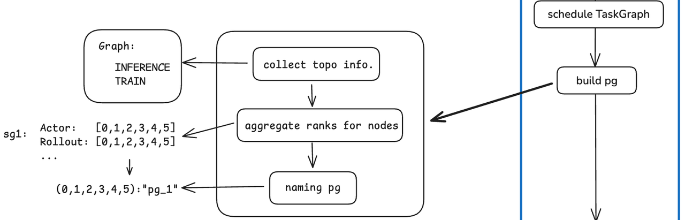
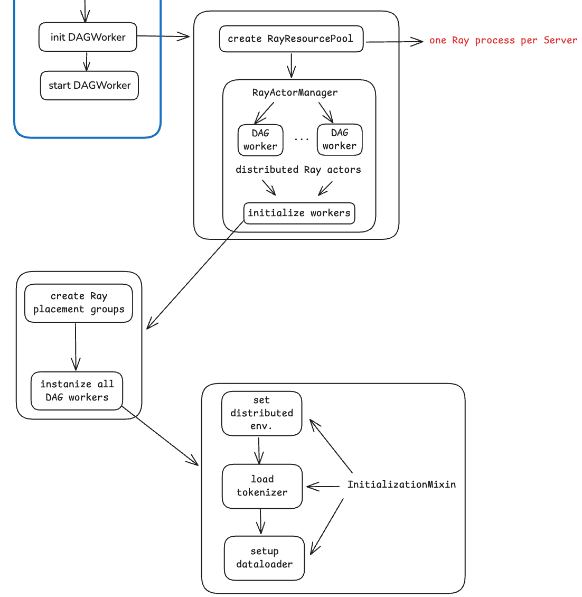

siiRL's Implementation Explained
================================

siiRL is under active development with an extensive roadmap for future enhancements. We strongly encourage community participation in this endeavor. Contributions in any form are highly valued, including but not limited to: filing issues, proposing new features, enhancing documentation, and providing suggestions for improvement.

Overall Implementation
----------------------

RL training itself has clear workflow characteristics, and DAG is the mainstream tool for describing workflows. Therefore, the source code of siiRL adopts a DAG-based design pattern. In terms of specific implementation, siiRL abstracts the entire RL training task into a TaskGraph composed of multiple Nodes, each of which implements the ``node.run()`` method to support the abstract orchestration of the top-level TaskGraph. The constructed TaskGraph is submitted to a set of DAGWorkers for execution.

In the context of multi-agent RL training, different DAGWorkers can process different TaskGraphs in parallel, and the data that different TaskGraphs depend on and process may also vary. Therefore, from a structural perspective, siiRL belongs to the MPMD paradigm.

In terms of user usage, in addition to the configurations related to Data/Trainer/Model/RL Algorithm used by mainstream RL frameworks, siiRL also provides DAG config, which supports users to customize workflows. The system will parse the DAG configuration when the training starts and correspondingly construct a TaskGraph instance.

Complex task workflow poses higher requirements for resource scheduling. To achieve fine-grained allocation of GPUs, siiRL implements a set of TaskScheduler, which is responsible for making globally optimal scheduling decisions, such as: how much computing resources to allocate to each TaskGraph, and specifically which GPU devices on which servers to use. Finally, the allocation plan generated by TaskScheduler is handed over to the underlying Ray framework for specific execution, making full use of Ray's distributed computing capabilities.

   Figure 1: Overall Architecture of siiRL

We will first provide an overview diagram of the siiRL source code implementation, and then, in the following text, we will introduce each part of the diagram in detail according to the actual execution process.

   Figure 2: Diagram of Source Code Implementation

Environment Abstraction
-----------------------

During initial RL stage of LLMs, the environment typically refers to the datasets used in post-training. siiRL abstracts the concept of environment to uniformly support RL tasks in different application areas, such as MCP calls and SandBox Server in agentic training scenarios, as well as simulators in the embodied AI domain, or real physical environments for agent interaction.

Similar to OpenAI Gym, siiRL defines two core asynchronous methods:

- ``reset()``: Resets the environment to its initial state and returns the initial observation. This function marks the start of a new episode.
- ``step(actions)``: Receives actions from one or multiple agents, executes these actions, updates the environment state, and returns a tuple containing (observation at the next time step, reward, information). This is the main loop for agent-environment interaction.

Taking the MathEnv of mathematical tasks as an example, the environment natively supports multiple agents. The step function receives a complex number of actions, and the returned observations are also an array prepared for each agent.

.. code-block:: python

   class MathEnv(BaseEnvironment):
       async def reset(self, dp_rank: int, ddp_world_size: int, seed: Optional[int] = None, options: Optional[Dict[str, Any]] = None):
           # ...
           obs = np.array([self.current_state for _ in range(self.n_agents)], dtype=np.object_)
           self.step_count = 0
           return obs
       
       async def step(self, actions):
           # ...
           return next_obs, rewards, infos

Control Flow: Pipeline
----------------------

The main pipeline of the siiRL control flow is shown in the figure below. First, load the configuration of the interactive environment, then sequentially complete the initialization of DataBuffer, the loading and parsing of DAG configuration, and the construction of TaskGraph. After the TaskGraph is constructed, the TaskScheduler schedules (makes decisions on) tasks, determining how many GPUs to allocate to each task and calculating the specific allocation topology. Then, use Ray to construct a distributed process group and initialize RayTrainer. Finally, initialize DAGWorker (Ray's Actor) and start the training task.

   Figure 3: Pipeline of Control Flow

DataLoader and DataBuffer
-------------------------

DataLoader is a wrapper for torch's StatefulDataLoader, which, in combination with the custom PartitionedRLHFDataset, is responsible for tasks such as loading, preprocessing, and batching of training data. Different from other RL open-source frameworks, DataLoader in siiRL is also abstracted as a Node (DataLoaderNode) and embedded into the TaskGraph for execution. Under normal cluster scale and RL tasks, siiRL launches a data_loader process for each GPU rank, which is responsible for loading the data shard corresponding to the DAGWorker on the current rank.

.. code-block:: python

   class DataLoaderNode(Node):
       """
       Represents a data loader node in the DAG.
       This version uses the PartitionedRLHFDataset for efficient, memory-safe
       distributed data loading. Each rank only loads and processes its own data slice.
       """
       def run(self, epoch: Optional[int] = None, is_validation_step: bool = False, **kwargs: Any) -> Any:
           """
           Executes the data loading process for a given step or validation.
           """
           try:
               # for validation
               if is_validation_step:
                   try:
                       batch = next(self._current_val_iter)
               # for training
               else:  
                   try:
                       batch = next(self._current_train_iter)
               return batch

DataBuffer is essentially a distributed KV Store, maintained by an independent Ray Actor process. Typically, DataLoader is per-gpu, while DataBuffer is per-server. In static batching mode, siiRL checks the load balance when creating DataBuffer, as shown in the figure below. For example, if the training batch size is 128, it needs to be divisible by the number of servers to ensure that a global batch can be evenly distributed among servers. Similarly, the batch size allocated to a server, after being replicated ``n`` times (the group size in GRPO, or ``n = 1`` if it is PPO), also needs to be divisible by 8 to ensure that it can be evenly distributed among GPUs on the same server.

   Figure 4: DataLoader, DataBuffer and Load Balance

TaskGraph Scheduling
--------------------

The core of TaskGraph is a dictionary composed of Nodes, and TaskGraph uses adjacency lists and reverse adjacency lists to represent the connection relationships between these Nodes. Among them, the reverse adjacency list is mainly used for dependency checking, such as Actor's training depending on rollout's generation. Meanwhile, TaskGraph provides a series of graph operation methods, such as adding, deleting, modifying, and querying nodes, DAG verification, copying, and displaying the graph, to implement the management of TaskGraph.

.. code-block:: python

   class Node:
       """
       Represents a node (task unit) in the DAG.
       """
       
   class TaskGraph:
       """
       Represents a Directed Acyclic Graph (DAG) of tasks, 
       composed of multiple Node objects and their dependencies.
       """

       def __init__(self, graph_id: str):
           """
           Initialize a task graph.
           Parameters:
               graph_id (str): The unique identifier of the graph.
           """
           self.graph_id: str = graph_id
           self.nodes: Dict[str, Node] = {} 
           self.adj: Dict[str, List[str]] = {}
           self.rev_adj: Dict[str, List[str]] = {}

The scheduling of TaskGraph includes four key steps:

1. **TaskGraph Splitting**: When a user-defined workflow contains parallel paths—as seen in multi-agent training where agents use both shared and specific Nodes—siiRL splits the original TaskGraph into multiple subgraphs for sequential execution. While this approach may not be the most efficient, it significantly simplifies resource scheduling.

2. **SubGraph Sorting**: To allocate resources reasonably, siiRL sorts all SubGraphs. The sorting is mainly based on two points. First, the size of the SubGraph, where this size refers to the parameter scale of the model to be trained on the current SubGraph (7B, 32B, 671B, etc.), with priority given to resource allocation for SubGraphs with larger parameter scales. Second, the number of Nodes on the SubGraph; the more Nodes, i.e., the "longer the chain" of the SubGraph, the earlier it is allocated.

3. **GPU Quota Allocation**: Based on the sorting results from Step 2, allocate the number of GPUs to each SubGraph. There are two allocation strategies: even and param_aware. In the even mode, the total number of GPUs is evenly distributed among SubGraphs as much as possible; in the param_aware mode, on the premise that each subgraph is allocated at least one GPU, subgraphs with larger sizes are allocated more GPUs as much as possible.

4. **GPU Topology Allocation**: With the allocation of the number of GPUs in Step 3, this step performs topology allocation. Suppose there are three SubGraphs, denoted as sg1, sg2, sg3, the training cluster consists of 2 machines with 16 GPUs, and the allocation result regarding the number in Step 3 is: (6, 5, 5), this step will determine "specifically, which 6 GPUs are allocated to sg1, which 6 to sg2, and finally, which 5 to sg3". siiRL makes decisions through a scoring mechanism:

   ``(cohesion_score(+), node_load_score(-), rank_preference_score(-))``

   Where: ``cohesion_score`` is the cohesion score: place a subgraph within the same server as much as possible to reduce communication; ``node_load_score`` is the load penalty: balance placement among servers as much as possible; ``rank_preference_score`` represents the rank partial order: place tasks on GPUs with smaller rank numbers as much as possible to make the scheduling behavior more predictable.

   Figure 5: TaskGraph Scheduling

Build the Distributed Process Group
-----------------------------------

After task scheduling is completed, the distributed process group of Ray can be constructed. According to the topology determined by the above scheduling, construct the affiliated process group for each Node of the TaskGraph.

For example, actor's training (described as ``NodeRole=Actor, NodeType=Train`` in siiRL), if the assigned ranks are ``[0, 1, 2, 3, 4, 5]``, then use Python's Tuple as the key and a unique string as the value for naming: ``(0,1,2,3,4,5): "process_group_1"``

   Figure 6: Distributed Process Group

Ray Trainer
-----------

After constructing the process group, initialize RayTrainer. This part is similar to the practices of other mainstream frameworks, with the core being the instantiation of Ray's resource pool management, i.e., resource_manager. Finally, collectively validate the configurations of all Nodes (Actor/Rollout/Reward, etc.).

   Figure 7: Ray Trainer

DAGWorker
---------

Through a series of abstractions regarding DAG and TaskGraph, siiRL encapsulates and hides the training job flow beneath the control flow. The call logic related to training backend, inference backend, sharding manager, etc., which is directly visible in the control flow of veRL, is all encapsulated into DAGWorker in siiRL and is almost invisible in the control flow. In terms of programming mode, this hiding provides a higher level of abstraction, offering more convenient modular reuse and more flexible extensibility compared to other mainstream frameworks, but it may additionally increase the complexity of bug localization.

In terms of source code implementation, DAGWorker uses mixin classes for modularization. The core mixin classes include 5, which are responsible for initialization, pipeline execution, execution of specific Nodes, training validation, and utility functions, respectively, as shown below.

When initializing DAGWorker, first call resource_manager (the one created during RayTrainer initialization) to create ResourcePool, then create RayActorManager to manage the lifecycle of all distributed DAGWorkers. Finally, call the method defined in the InitializationMixin mixin class to complete the initialization of DAGWorker.

   Figure 8: Initialization of DAG Worker

When setting up the communication group, siiRL adopts the following strategy: if the total number of ranks is less than 256, it uses the pure NCCL backend; otherwise, it uses the GLOO+NCCL hybrid backend. In the hybrid backend mode, GLOO is mainly used for aggregated communication of data such as logs and metrics.

Training Initiation
-------------------

The main pipeline initiates training in the final step. Here, it primarily calls the ``execute_task_graph`` method in the ExecutionMixin mixin class. This method encapsulates the outer loop of epochs and the inner loop of batches within each epoch (i.e., a training step).

   Figure 9: Training Job Initialization

Each training step is no longer "concrete and expanded", as in mainstream frameworks such as veRL, but rather "abstract and cyclic": traverse all Nodes in the Graph, for each Node, execute the run method, and write the resulting data to the DataBuffer, where the key is the node_id of the next node and the value is the output of the run method.

   Figure 10: Loop of TaskGraph Computation based on DataBuffer

